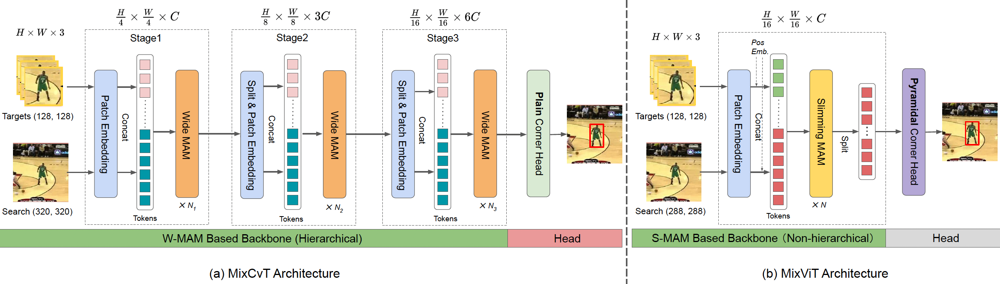

# MixFormer

The implementation of the RDT-TEF (RGB-D visual object tracking with transformer-based multi-modal feature fusion)




## News

**[Feb 10, 2023]** 

- :fire::fire::fire:  **Code and models for MixViT and MixViT-ConvMAE are available now !** Thank [Tianhui Song](https://github.com/songtianhui) for helping us clean up the code.

**[Feb 8, 2023]**
- Extended version has been available at https://arxiv.org/abs/2302.02814. In particular, the extented **MixViT-L(ConvMAE)** achieves AUC score of 73.3% on LaSOT. Besides, we design a new **TrackMAE** pre-training method for tracking. Code and models will be updated soon.

**[Oct 26, 2022]**

- MixFormerL (based on MixViT-L) rank  <font color='red'>**1/41 on VOT2022-STb public**</font> dataset. 
- The <font color='red'>**VOT2022-RGBD and VOT2022-D winners**</font> of MixForRGBD and MixForD, implemented by [Lai Simiao](https://github.com/laisimiao), are constructed upon our MixFormer.
- The VOT2022-STs winner of MS-AOT employs MixFormer as a part of the tracker.  The VOT2022-STb winner of APMT_MR employs the SPM proposed in MixFormer to select dynamic templates.

**[Mar 29, 2022]**

- Our paper is selected for an <font color='red'> **oral** </font> presentation.

**[Mar 21, 2022]**

- MixFormer is accepted to **CVPR2022**.
- We release Code, models and raw results.


## Highlights
### :sparkles: New transformer tracking framework
MixFormer is composed of a **target-search mixed attention (MAM) based backbone** and a simple corner head, 
yielding a compact tracking pipeline without an explicit integration module.


### :sparkles: End-to-end, post-processing-free

Mixformer is an end-to-end tracking framework without post-processing. 

### :sparkles: Strong performance
| Tracker | VOT2020 (EAO) | LaSOT (NP)| GOT-10K (AO)| TrackingNet (NP)|
|---|---|---|---|---|
|**MixViT-L (ConvMAE)**|0.567|**82.8**|-|**90.3**|
|**MixViT-L**|**0.584**|82.2|**75.7**|90.2|
|**MixCvT**|0.555|79.9|70.7|88.9|
|ToMP101* (CVPR2022)|-|79.2|-|86.4|
|SBT-large* (CVPR2022)|0.529|-|70.4|-|
|SwinTrack* (Arxiv2021)|-|78.6|69.4|88.2|
|Sim-L/14* (Arxiv2022)|-|79.7|69.8|87.4|
|STARK (ICCV2021)|0.505|77.0|68.8|86.9|
|KeepTrack (ICCV2021)|-|77.2|-|-|
|TransT (CVPR2021)|0.495|73.8|67.1|86.7|
|TrDiMP (CVPR2021)|-|-|67.1|83.3|
|Siam R-CNN (CVPR2020)|-|72.2|64.9|85.4|
|TREG (Arxiv2021)|-|74.1|66.8|83.8|

## Install the environment
Use the Anaconda
```
conda create -n mixformer python=3.8
conda activate mixformer
bash install_pytorch17.sh
```


## Model Zoo and raw results
The trained models and the raw tracking results are provided in the 
[[Models and Raw results]](https://pan.baidu.com/s/1G4MzOGSTMWegTcyr9aP4Lg) (Baidu Driver: rgbd).

<!-- ## Contact
Yutao Cui: cuiyutao@smail.nju.edu.cn  -->

## Acknowledgments
* Thanks for [Mixformer](https://github.com/MCG-NJU/MixFormer) Library and [AlphaRefine
](https://github.com/MasterBin-IIAU/AlphaRefine) Library, which helps us to quickly implement our ideas.


<!-- ## ✏️ Citation

If you think this project is helpful, please feel free to leave a star⭐️ and cite our paper:

```
@inproceedings{cui2022mixformer,
  title={Mixformer: End-to-end tracking with iterative mixed attention},
  author={Cui, Yutao and Jiang, Cheng and Wang, Limin and Wu, Gangshan},
  booktitle={Proceedings of the IEEE/CVF Conference on Computer Vision and Pattern Recognition},
  pages={13608--13618},
  year={2022}
}
@misc{cui2023mixformer,
      title={MixFormer: End-to-End Tracking with Iterative Mixed Attention}, 
      author={Yutao Cui and Cheng Jiang and Gangshan Wu and Limin Wang},
      year={2023},
      eprint={2302.02814},
      archivePrefix={arXiv}
} -->
<!-- ``` -->
